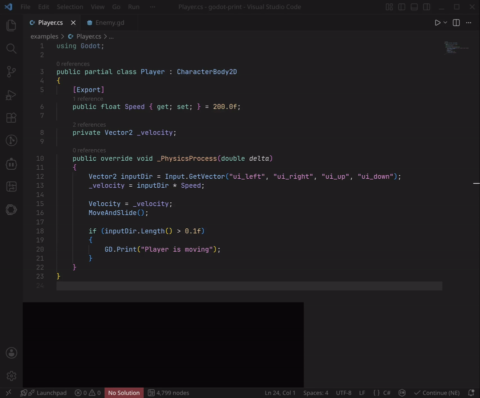

# Godot Print



Quickly insert debug print statements for selected variables in Godot C# and GDScript — with smart Vector2/3 expansion and one-key cleanup.

## Features

**Insert Print** (`Ctrl+Alt+D`) — three modes:

| Mode | What it does | Example |
|---|---|---|
| **Cursor on variable** | Detects expression under cursor, inserts print after the statement | `inputDir` → `GD.Print("[Player] inputDir={inputDir}")` |
| **Select assignment(s)** | Extracts variable names from `var x = ...` lines | select `var health = 100` → `print("[Enemy] health={health}")` |
| **Select any expression** | Uses selection text directly as the expression to print | select `speed * delta` → `print("[Enemy] speed * delta={speed * delta}")` |

**Smart Vector Expansion** — automatically expands `Vector2`/`Vector3`/`Color` to their components:

```csharp
// Before:  GD.Print($"[Player] inputDir={inputDir}")
// After:   GD.Print($"[Player] inputDir.X={inputDir.X}, inputDir.Y={inputDir.Y}")
```

- C# uses `X, Y, Z, W`, GDScript uses `x, y, z, w`
- Detects type from the variable declaration automatically
- Can be disabled via `godot-print.expandVectors` setting

**Clean Prints** (`Ctrl+Alt+C`) — removes all debug prints in the current file:
- Matches both `GD.Print(...)` and `print(...)` across multiple lines
- Uses precise range edits, not full-document replace

## Installation

### From VS Code Marketplace (recommended)

Search for "Godot Print" in the Extensions panel (`Ctrl+Shift+X`).

### From VSIX

1. Download the `.vsix` file from Releases
2. In VS Code: Extensions → `...` → Install from VSIX

## Configuration

Open Settings (`Ctrl+,`) and search for "godot-print":

| Setting | Default | Description |
|---|---|---|
| `godot-print.printTemplate.gdscript` | `print("[{className}] {body}")` | Template for GDScript prints |
| `godot-print.printTemplate.csharp` | `Godot.GD.Print($"[{className}] {body}");` | Template for C# prints |
| `godot-print.expandVectors` | `true` | Expand Vector2/3/4 and Color to components |

### Template placeholders

- `{className}` — auto-detected class name (e.g., `Player`, `Enemy`)
- `{body}` — variable expression(s) like `health={health}` or `X={inputDir.X}, Y={inputDir.Y}`

## Keybindings

| Command | Key | Description |
|---|---|---|
| `godot-print.print` | `Ctrl+Alt+D` | Insert debug print |
| `godot-print.clean` | `Ctrl+Alt+C` | Remove all debug prints |

Both work on C# (`.cs`) and GDScript (`.gd`) files with auto-detection.

## Requirements

- VS Code 1.80+
- A Godot project with C# or GDScript scripts

## License

MIT
